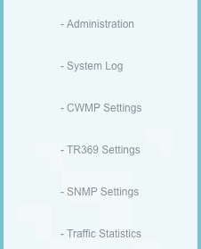
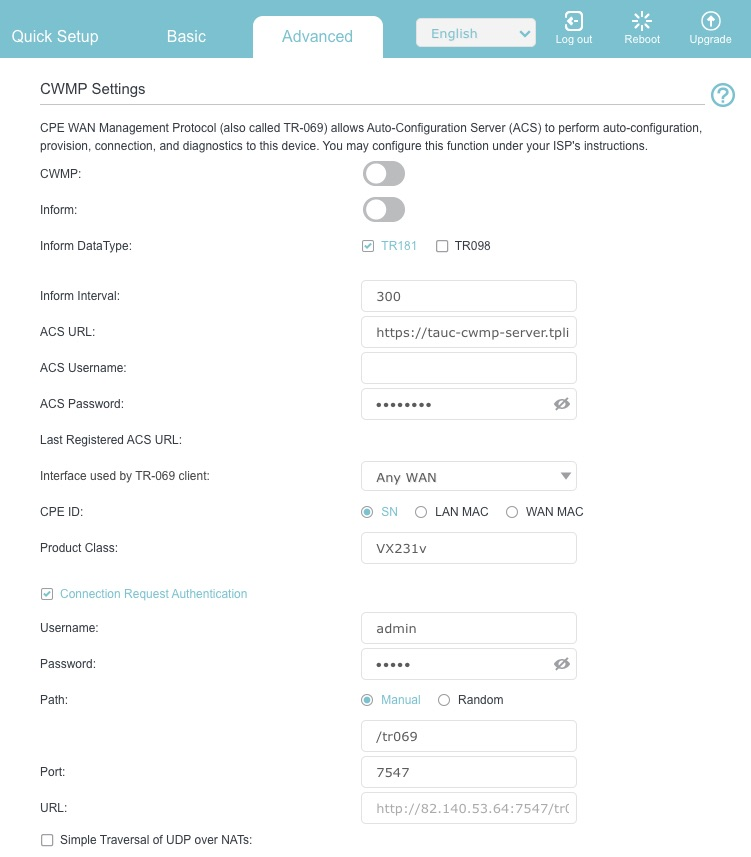
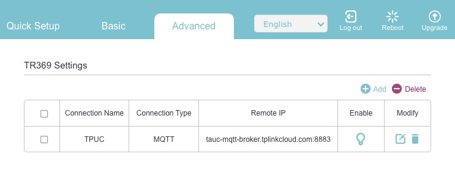
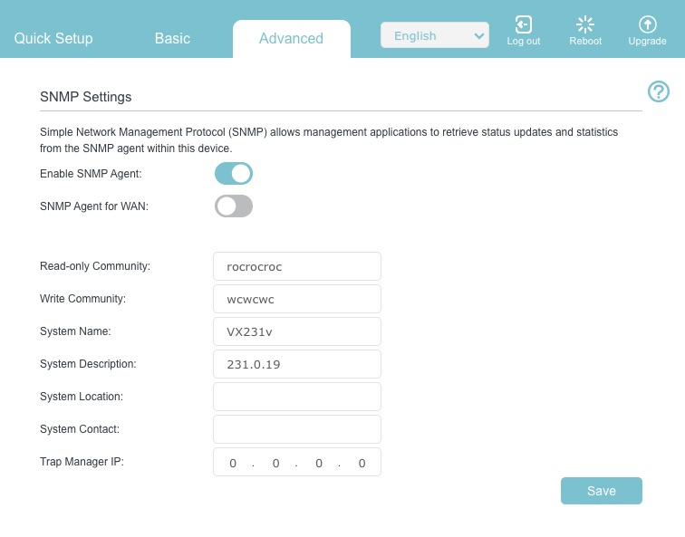

# VX231v: Enable superadmin, SNMP, TELNET and iperf3

I was looking for an easy way to monitor connected clients and real-time traffic.

The PDF manual for the VX231v [VX231v(DE)_UG_REV1.0.0.pdf](https://static.tp-link.com/upload/manual/2024/202408/20240816/1910020944_VX231v%28DE%29_UG_REV1.0.0.pdf) covers **SNMP Settings** in chapter 17.10.
But these options are inaccessible to **standard users**. To use SNMP features, the **superadmin** account must be activated.

__Warning: You can only activate the superadmin account right after a factory reset. This will wipe all your settings!__

**Steps to enable the superadmin**

* Hold the Reset button on the back for about 10 seconds.
* Once the blue light blinks, connect via LAN and go to http://192.168.1.1/superadmin.
* Set a password for 'superadmin'
* enter your ISP credentials, and head to Advanced > System.

You should now see three additional sub menus



<details>
  <summary><b>CWMP Settings</b> (Click to show screenshot)</summary>
  <br>
  
</details>

<details>
  <summary><b>TR369 Settings</b> (Click to show screenshot)</summary>
  <br>
  
</details>

<details>
  <summary><b>SNMP Settings</b> (Click to show screenshot)</summary>
  <br>
  
</details>

* Go to **SNMP Settings** and enable the SNMP Agent. But make sure to disable it for WAN.
Set your Community Strings for Read-only and Write access.

* Go to the **Administration** menu, select the standard user from the dropdown, and set a login password.<details>
  
</details>

* *Optional*: before leaving the **Administration** menu scroll down to activate **TELNET** and **iperf3**<details>
  
</details>

After that, you can log in normally via the standard IP or use the /superuser path for full access.

## TELNET
Use the superadmin password for Telnet authentication.<br>
```
> telnet 192.168.1.1
Trying 192.168.1.1...
Connected to 192.168.1.1.

-------------------------------------------------------
Welcome To Use TP-Link COMMAND-LINE Interface Model.
-------------------------------------------------------
TP-Link(conf)#help
normal mode commands:
        clear           ---     clear screen
        exit            ---     leave to the privious mode
        help            ---     help info
        history         ---     show histroy commands
        logout          ---     logout cli model
        wlctl           ---     wireless config
config mode commands:
        config          ---     enter config mode
        adsl            ---     config adsl
        igmp            ---     igmp config
        wan             ---     wan config
        voip            ---     voip config
        lan             ---     lan config
        group           ---     group config
        dev             ---     device control
```

## iperf3
iperf3 -c 192.168.1.1<br>
_iperf3: error - unable to connect to server_

The **iperf3** server on this router listens on **port 5001** (the legacy iperf2 default port).<br>Therefore, you must specify the port explicitly using **-p 5001**:<br>
```
> iperf3 -c 192.168.1.1 -p 5001
Connecting to host 192.168.1.1, port 5001
[  5] local 192.168.1.101 port 52616 connected to 192.168.1.1 port 5001
[ ID] Interval           Transfer     Bitrate
[  5]   0.00-1.00   sec  82.0 MBytes   687 Mbits/sec                  
[  5]   1.00-2.00   sec  79.8 MBytes   667 Mbits/sec                  
[  5]   2.00-3.00   sec  78.1 MBytes   656 Mbits/sec                  
[  5]   3.00-4.00   sec  79.0 MBytes   662 Mbits/sec                  
[  5]   4.00-5.00   sec  79.5 MBytes   666 Mbits/sec                  
[  5]   5.00-6.00   sec  83.6 MBytes   703 Mbits/sec                  
[  5]   6.00-7.00   sec  79.5 MBytes   667 Mbits/sec                  
[  5]   7.00-8.00   sec  79.1 MBytes   664 Mbits/sec                  
[  5]   8.00-9.00   sec  76.9 MBytes   645 Mbits/sec                  
[  5]   9.00-10.00  sec  84.1 MBytes   705 Mbits/sec                  
- - - - - - - - - - - - - - - - - - - - - - - - -
[ ID] Interval           Transfer     Bitrate
[  5]   0.00-10.00  sec   802 MBytes   672 Mbits/sec                  sender
[  5]   0.00-10.00  sec   801 MBytes   672 Mbits/sec                  receiver

iperf Done.
```

As I haven't found any VX231v specific documention I ended up using Google Gemini to brute-force/trial-and-error the available OIDs.

## SNMP Python Demo 
[Check out the SNMP Python script](vx231v-snmp-demo.py).

The script lists the connected clients and monitors real-time throughput data and is tested on macos 26.

### Demo Output Python

```
Querying ARP table from 192.168.1.1...
IP Address       | MAC Address      
------------------------------------
192.168.1.52   | string::b8:27:eb:8e:ca:fe
192.168.1.53   | string::e4:5f:1:58:ca:fe
192.168.1.90   | string::70:4f:57:51:ca:fe
192.168.1.100  | string::3c:28:6d:da:ca:fe
192.168.1.101  | string::14:98:77:4e:ca:fe
192.168.1.103  | string::ee:90:2:43:ca:fe
192.168.1.105  | string::aa:98:bf:55:ca:fe
------------------------------------

Starting real-time WAN monitoring (Index 52)...
Down: 109.52 Mbps | Up:   3.67 Mbps
Down: 215.80 Mbps | Up:   6.97 Mbps
Down: 215.83 Mbps | Up:   6.91 Mbps
Down: 216.50 Mbps | Up:   7.26 Mbps
Down:   1.98 Mbps | Up:  50.19 Mbps
Down:   1.98 Mbps | Up:  49.08 Mbps
```

## SNMP BASH Demo 
[Check out the SNMP BASH script](vx231v-snmp-demo.sh).


### Demo Output BASH

```
TP-Link VX231v SNMP Demo

Router Name      : VX231v
Firmware Version : 231.0.19
Uptime d:hh:mm:ss: 2:3:54:20.00

--- IP Networks ---
Main Network: 192.168.1.1 / 255.255.255.0
Guest Network: 192.168.210.1 / 255.255.255.0

--- Live Internet Traffic  ---
Please wait ... sampling interval: 5 seconds
Download: 1925 kbit/s | Upload: 47970 kbit/s

--- Connected Clients ---
IP-Address      | MAC-Address      
192.168.1.52  | b8:27:eb:8e:ca:fe
192.168.1.53  | e4:5f:1:58:ca:fe 
192.168.1.90  | 70:4f:57:51:ca:fe
192.168.1.100 | 14:98:77:4e:ca:fe
192.168.1.101 | ee:90:2:43:ca:fe 
192.168.1.103 | ee:90:2:43:ca:fe
192.168.210.100 | aa:98:bf:1a:ca:fe 
```
