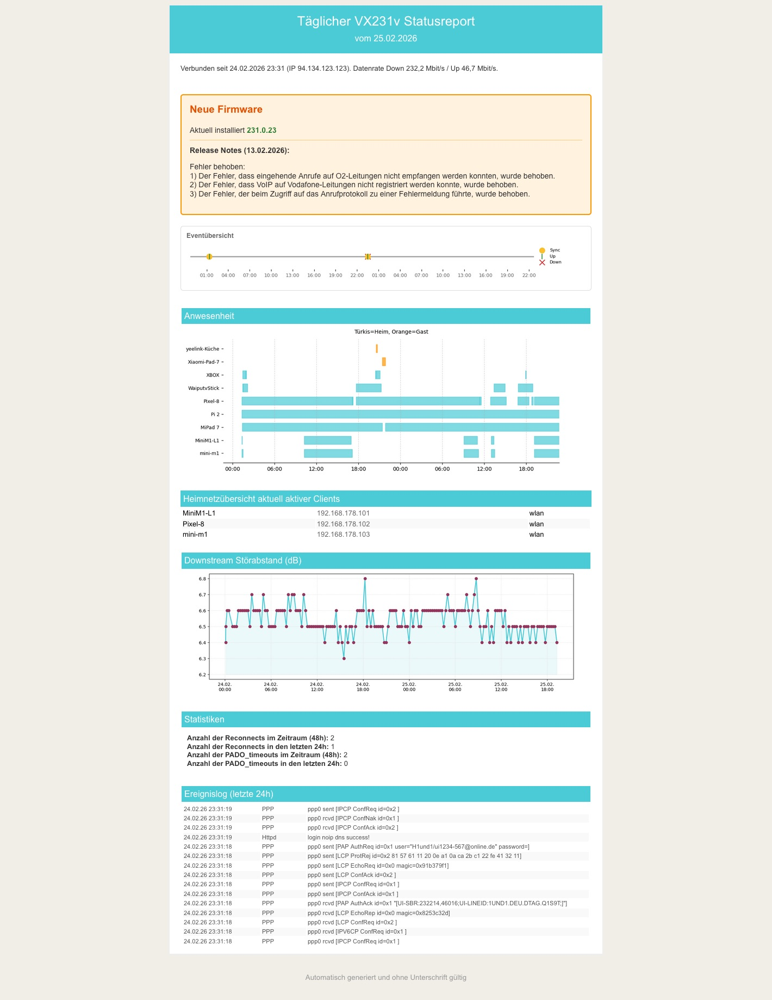
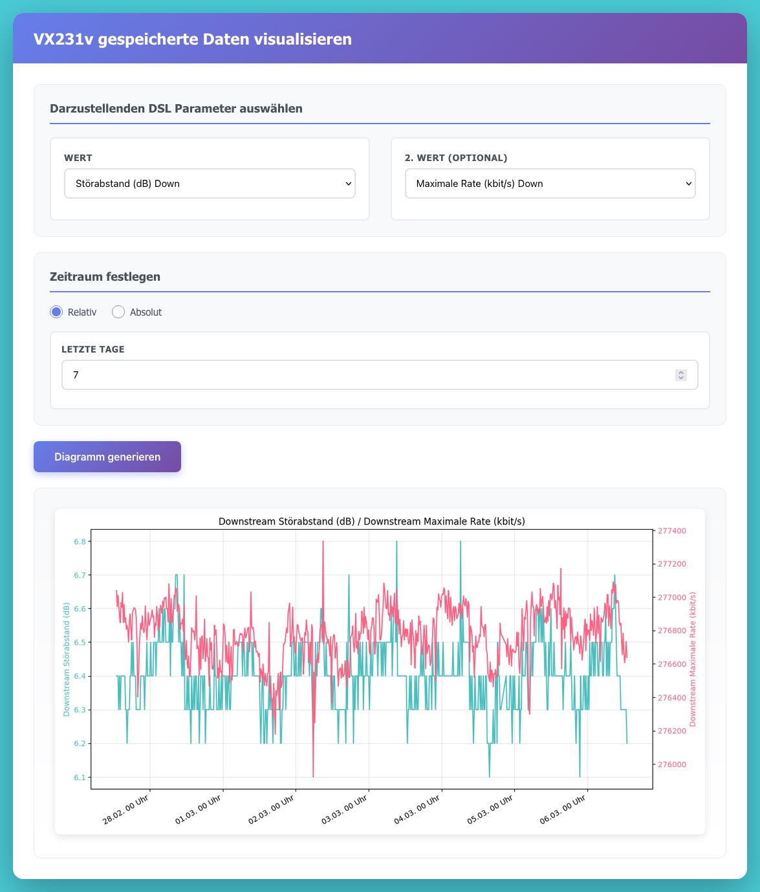

# TP-Link VX231v Tools

Skripte und Anleitungen für den TP-Link VX231v Router

---

### 1. [Aktivierung Superadmin, Telnet, SNMP und iPerf3](superadmin_telnet_snmp_iperf.md)
Zusätzliche Funktionen des Router aktivieren und nutzen.
**Inhalte:**
* Aktivierung des `superadmin`-Accounts
* Aktivierung von **Telnet** und **SNMP** für den Netzwerkzugriff
* Aktivierung des **iPerf3**-Servers zur Bandbreitenmessung

[Zur Aktivierungsanleitung:](superadmin_telnet_snmp_iperf.md)

---

### 2. [Router Monitoring: VX-Info Tracker](vx-info.md)
Ein Set aus Python-Skripten (`vx-info.py`) zur automatisierten Erfassung und Darstellung der Routerdaten.
**Inhalte:**
* Datenabruf von DSL-Werten und der verbundenen Clients via SNMP, Telnet und Web-Scraping
* Speicherung der Daten in einer Datenbank
* Automatisierte Generierung von HTML-Statusberichten
  <details>
      <summary>Beispiel: Statusreport</summary>
      <br>
      
  </details>
* Lokales Web-Dashboard zur Visualisierung
  <details>
      <summary>Beispiel: Dashboard</summary>
      <br>
      
  </details>

<br>

**Schnelle Installation:**
```bash
curl -sL https://raw.githubusercontent.com/deinname/tp-link-vx231v/main/install.sh | bash
```
<br>
<details>
<summary>Beispiel: Installationsverlauf</summary>

```
curl -sL https://raw.githubusercontent.com/deinname/tp-link-vx231v/main/install.sh | bash

==== tp-link-vx231v Installation ====

[1/11] Klone das Repository...
Cloning into 'tp-link-vx231v'...
remote: Enumerating objects: 124, done.
remote: Counting objects: 100% (124/124), done.
Receiving objects: 100% (124/124), 2.45 MiB | 4.88 MiB/s, done.

[2/11] Wechsle in das Verzeichnis...

[3/11] Erstelle virtuelle Umgebung...
      Aktiviere virtuelle Umgebung...

[4/11] Installiere Abhängigkeiten...
Collecting playwright
  Downloading playwright-1.42.0-py3-none-macosx_11_0_arm64.whl
Successfully installed playwright-1.42.0 requests

[5/11] Installiere Chromium in Playwright...
Downloading Chromium 123.0.6312.4 (playwright build v1105)...
Playwright build of Chromium is installed.

[6/11] OPTIONAL: SNMP / TELNET verwenden
      Falls Sie mit dem superadmin Account Ihres Routers
      SNMP und Telnet aktiviert haben, können Sie
      Routerdaten auch per SNMP abrufen.
      Dafür benötigen Sie 'snmpget' und 'snmpwalk'.
      Möchten Sie SNMP-Tools jetzt installieren? (j/N) j
      Installiere net-snmp via Homebrew (macOS)...
      🍺  net-snmp wurde erfolgreich installiert!

[7/11] OPTIONAL: AI-Analyse Einrichtung (nur macOS)...
      Die Routerdatenanalyse wird über einen Apple Kurzbefehl 'ai-cloud' ausgeführt.
      Dieser Kurzbefehl muss manuell in der Kurzbefehle-App angelegt werden,
      wie in der Dokumentation beschrieben.
      Haben Sie den Kurzbefehl 'ai-cloud' bereits angelegt oder möchten Sie dies später tun? [Enter]

[8/11] Überprüfe Konfigurationsdatei...
      -> config.ini wurde aus der Vorlage (config.ini.sample) erstellt.

[9/11] Konfigurationsdatei anpassen
      Bitte passen Sie nun die Zugangsdaten in der config.ini an.
      Drücken Sie [Enter], um die Datei im Editor zu öffnen...

[10/11] Teste das Skript...

GUI Scraping
  ✓  Login in Routerweboberfläche erfolgreich
Telnet Konfiguration
  ✓  telnet Login erfolgreich
SNMP Konfiguration
  ✓  snmp Zugriff erfolgreich
eMail Konfiguration
  ✓  eMail erfolgreich versendet

==== Installation abgeschlossen! ====

[11/11] Skript in Cronjob eintragen
Vorschlag für Ihre crontab:

Einmal stündlich: Systemstatus, Clients, DSL-Werte, Log sichern
0 * * * * cd /Users/user/tp-link-vx231v && /Users/user/tp-link-vx231v/.venv/bin/python3 vx-info.py --update --log
Täglich um 06:10 Uhr: Statusbericht generieren und per E-Mail versenden
10 6 * * * cd /Users/user/tp-link-vx231v && /Users/user/tp-link-vx231v/.venv/bin/python3 vx-info.py --report-send

Möchten Sie jetzt 'crontab -e' öffnen? (j/N) n
Übersprungen. Sie können die Crontab später jederzeit mit 'crontab -e' bearbeiten.

Fertig!
```
</details>
<br>


[Zur Installationsanleitung: VX-Info Tracker](vx-info.md)

---

**Getestet unter MacOS und Debian/DietPi auf einem Raspberry Pi Zero 2W**