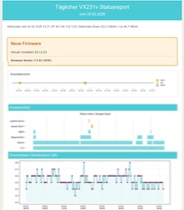
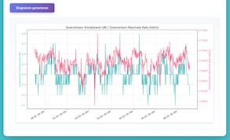

# TP-Link VX231v Tools

Skripte und Anleitungen für den TP-Link VX231v Router

---
> **Hinweis:** Die optisch aufbereitete Version dieser Dokumentation liegt unter:<br>
> **[https://einstweilen.github.io/tp-link-vx231v/](https://einstweilen.github.io/tp-link-vx231v/)**
---

### 1. [Aktivierung Superadmin, Telnet, SNMP und iPerf3](superadmin_telnet_snmp_iperf.md)
Zusätzliche Funktionen des Router aktivieren und nutzen.
**Inhalte:**
* Aktivierung des `superadmin`-Accounts
* Aktivierung von **Telnet** und **SNMP** für den Netzwerkzugriff
* Aktivierung des **iPerf3**-Servers zur Bandbreitenmessung

<br>
<details>
<summary>Schnellanleitung: Aktivierung des superadmin</summary>

**WICHTIG:** Durch den Werksreset gehen alle Router-Einstellungen verloren!

* Reset-Knopf auf der Router-Rückseite ca. 10 Sekunden gedrückt halten
* Sobald die blaue LED blinkt, per LAN verbinden und http://192.168.1.1/superadmin aufrufen
* Passwort für "superadmin" vergeben
* ISP-Zugangsdaten eingeben

</details>

[Zur vollständigen Aktivierungsanleitung](superadmin_telnet_snmp_iperf.md)

---

### 2. [Router Monitoring: VX-Info Tracker](vx-info.md)
Ein Set aus Python-Skripten (`vx-info.py`) zur automatisierten Erfassung und Darstellung der Routerdaten.
**Inhalte:**
* Datenabruf von DSL-Werten und der verbundenen Clients via SNMP, Telnet und Web-Scraping
* Speicherung der Daten in einer Datenbank
* Automatisierte Generierung von HTML-Statusreports
  <details>
      <summary>
          
          <br>
          <i>Anklicken für vollständigen Statusreport</i>
      </summary>
      <br>
      
  </details>
* Lokales Browser-Dashboard zur Visualisierung
  <details>
      <summary>
          
          <br>
          <i>Anklicken für vollständiges Dashboard</i>
      </summary>
      <br>
      
  </details>

<br>

**Schnelle Installation:**
```bash
curl -sL https://raw.githubusercontent.com/einstweilen/tp-link-vx231v/main/install.sh | bash
```
<br>
<details>
<summary>Beispielablauf der Schnellen Installation</summary>

```
curl -sL https://raw.githubusercontent.com/einstweilen/tp-link-vx231v/main/install.sh | bash

==== tp-link-vx231v Installation ====

[1/12] Klone das Repository...
Cloning into 'tp-link-vx231v'...
remote: Enumerating objects: 124, done.
remote: Counting objects: 100% (124/124), done.
Receiving objects: 100% (124/124), 2.45 MiB | 4.88 MiB/s, done.

[2/12] Wechsle in das Verzeichnis...

[3/12] Erstelle virtuelle Umgebung...
      Aktiviere virtuelle Umgebung...

[4/12] Installiere Abhängigkeiten...
Collecting playwright
  Downloading playwright-1.42.0-py3-none-macosx_11_0_arm64.whl
Successfully installed playwright-1.42.0 requests

[5/12] Installiere Chromium in Playwright...
Downloading Chromium 123.0.6312.4 (playwright build v1105)...
Playwright build of Chromium is installed.

[6/12] OPTIONAL: SNMP / TELNET verwenden
      Falls mit dem superadmin Account des Routers
      SNMP und Telnet aktiviert wurden, können
      Routerdaten auch per SNMP/Telnet abgerufen werden.
      Hinweis: Werden SNMP/Telnet genutzt, läuft
      --update im schnellen SNMP/Telnet-Modus.
      Andernfalls wird das langsamere GUI-Scraping genutzt.
      Sollen SNMP-Tools jetzt installiert werden? (j/N) j
      Installiere net-snmp via Homebrew (macOS)...
      🍺  net-snmp wurde erfolgreich installiert!

[7/12] Überprüfe Konfigurationsdatei...
      -> config.ini wurde aus der Vorlage (config.ini.sample) erstellt.

[8/12] Interaktive Router-Konfiguration
      Wie lautet die IP-Adresse des Routers? [192.168.1.1]: 192.168.1.1
      Bitte das Passwort für das Web-Interface (GUI) eingeben: ********
      Trage Daten in config.ini ein...
      Teste Login mit den angegebenen Daten...
      ✓ Login am Router erfolgreich!

[9/12] Globalen Befehl (Alias) einrichten...
      Pfad wurde zu /Users/user/.zshrc hinzugefügt.
      Befehl 'vx-info' (z.B. vx-info --dashboard) ist jetzt global verfügbar.
      (Wirksam nach einem Neustart des Terminals oder nach: source /Users/user/.zshrc)

[10/12] OPTIONAL: AI-Analyse Einrichtung (nur macOS)...
      Die Routerdatenanalyse wird über einen Apple Kurzbefehl 'ai-cloud' ausgeführt.
      Dieser Kurzbefehl muss manuell in der Kurzbefehle-App angelegt werden,
      wie in der Dokumentation beschrieben.
      Wurde der Kurzbefehl 'ai-cloud' bereits angelegt oder soll dies später erfolgen? [Enter]

[11/12] Cronjobs automatisch einrichten
      Sollen die periodischen Abfrage-Jobs für cron eingerichtet werden? (j/N) j
      Es wurde angegeben, SNMP/Telnet zu nutzen.
      Hinzugefügt: Alle 15 Min '--update', 5 Min nach der vollen Stunde '--log'
      Soll täglich um 06:10 Uhr ein Statusbericht per Mail versandt werden? (j/N) n
      ✓ Cronjobs erfolgreich eingerichtet!

[12/12] Installation testen...
      Es wird nun ein kurzer Verbindungstest ausgeführt...

GUI Scraping
  ✓  Login in Routerweboberfläche erfolgreich
Telnet Konfiguration
  ✓  telnet Login erfolgreich
SNMP Konfiguration
  ✓  snmp Zugriff erfolgreich
eMail Konfiguration
  ✓  eMail erfolgreich versendet

==== Installation abgeschlossen! ====
Tipp: Da der Alias angelegt wurde, kann das Script ab sofort gestartet werden mit:
vx-info --OPTION
```
</details>
<br>


[Zur Installationsanleitung: VX-Info Tracker](vx-info.md)

---

**Getestet unter MacOS und Debian/DietPi auf einem Raspberry Pi Zero 2W**