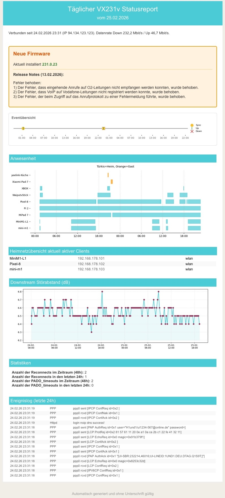

# TP-Link VX231v Tracker

Eine Sammlung von Python-Skripten zur Erfassung, Speicherung und Visualisierung der Router-Daten.

Ausgangspunkt war der Wunsch, DSL-Leitungswerte und Netzwerk-Clients kontinuierlich aufzuzeichnen, um Verbindungsabbrüche und Fehlerraten im zeitlichen Verlauf nachvollziehen zu können. 
Da der TP-Link VX231v keine offizielle API für diese Zwecke bereitstellt, automatisiert dieses Skript-Set den Datenabruf über die am Router verfügbaren Schnittstellen.  
Ist auf dem Router der superadmin-Zugang aktiviert ([Zur Anleitung](https://github.com/einstweilen/tp-link-vx231v/blob/main/superadmin_telnet_snmp_iperf.md)) können die Leitungswerte per Telnet und SNMP in Sekunden erfasst werden. 
Für Daten, die darüber nicht zugänglich sind oder falls der superadmin-Zugang nicht aktiviert ist, erfolgt ein automatisiertes Auslesen der Daten aus der Weboberfläche des Router, was allerdings länger dauert.

??? info "Beispiel für einen Statusreport"
    

??? info "Beispiel für das Browser-Dashboard"
    

## Funktionsumfang

*   **Datenerfassung:** Automatisierter Abruf von Systemzuständen, DSL-Werten und Client-Listen primär per Telnet und SNMP. Für Daten, die darüber nicht zugänglich sind, erfolgt ein Auslesen der Weboberfläche des Routers.
*   **Datenspeicherung:** Alle erfassten Messwerte, verbundenen Geräte und System-Logs werden fortlaufend in einer SQLite-Datenbank gespeichert.
*   **Reporting:** Die gesammelten Daten der letzten 24 Stunden können als HTML-Statusbericht aufbereitet werden. Der Bericht enthält unter anderem aktuelle Verbindungsparameter, Auszüge aus dem Event-Log und ein Anwesenheitsdiagramm der Clients. Der Versand kann automatisiert per E-Mail erfolgen.
*   **Lokales Browser-Dashboard:** Ein integrierter lokaler Webserver ermöglicht die interaktive grafische Visualisierung der historisierten DSL-Parameter über frei wählbare Zeiträume.

([Release Notes anzeigen](release-notes.md))

## Dokumentationsübersicht

*   [**Setup & Installation**](setup.md) - Systemvoraussetzungen (inkl. Aktivierung des Superadmin-Zugangs) und Installation.
*   [**Konfiguration**](konfiguration.md) - Syntax der `config.ini`, Startparameter und Einrichtung der automatisierten Ausführung.
*   [**Auswertungen - Statusreport**](report.md) - Erläuterung der Inhalte und Parameter des generierten HTML-Berichts.
*   [**Auswertungen - Browser-Dashboard**](dashboard.md) - Nutzung der lokalen, interaktiven Ansicht für historische Daten.
*   [**Lokalisierung**](lokalisierung.md) - Anleitung zur Anpassung der Tabellenansicht auf andere Sprachen.

---
*Weitere Informationen unter [vx-info.md](https://github.com/einstweilen/tp-link-vx231v/blob/main/vx-info.md).*
