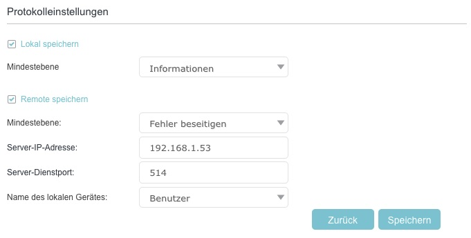

# Konfiguration

Die Vorlage `config.ini.sample` zu `config.ini` kopieren.
Anschließend die Zugangsdaten für die Router Weboberfläche, SNMP, telnet sowie die E-Mail-Konfiguration an das eigene Netzwerk anpassen.

Für eine detaillierte Erklärung der einzelnen Parameter, siehe [config-details.md](config-details.md).

## Testlauf durchführen (`--test`)

Überprüfen, ob die Kommunikation mit dem Router funktioniert und alle Abhängigkeiten korrekt installiert sind. Dies sollte als erster Schritt ausgeführt werden (Achtung: venv muss aktiv sein!):
```bash
python3 vx-info.py --test
```
Bei einer erfolgreichen Konfiguration sieht die Ausgabe folgendermaßen aus:
```text
GUI Scraping
  ✓  Login in Routerweboberfläche erfolgreich

Telnet Konfiguration
  ✓  telnet Login erfolgreich

SNMP Konfiguration
  ✓  snmp Zugriff erfolgreich

eMail Konfiguration
  ✓  eMail erfolgreich versendet
```

## Erster Datenabruf

Wenn der Testlauf erfolgreich war, kann das vollständige Logbuch manuell heruntergeladen und die Datenbank initialisiert werden:
```bash
python3 vx-info.py --update --log
```

## Ausführungsoptionen (CLI)

Hauptskript `vx-info.py` mit folgenden Aufrufparametern:

*   `--update`: Fragt grundlegende Daten (Systemstatus, DSL-Werte, Client-Liste) primär über Telnet/SNMP ab und speichert sie in der Datenbank. Sind Telnet/SNMP nicht verfügbar, wird das Web-Scraping-Interface genutzt.
<br>
*   `--log`: Lädt das vollständige Systemprotokoll ("Logbuch") des Routers via Playwright-(Web-Scraping) herunter und importiert neue Ereignisse (wie DHCP/Mesh). Häufig in Kombination mit `--update` genutzt.
<br>
*   `--gui`: Erzwingt den Datenabruf (Systemstatus, DSL, Clients) ausschließlich über das Web-Scraping-Interface anstelle von Telnet/SNMP.
<br>
*   `--report-show`: Generiert den HTML-Statusreport basierend auf den aktuellen Datenbankwerten und öffnet diesen direkt im Standard-Browser.
<br>
*   `--report-send`: Generiert den HTML-Statusreport und versendet diesen über die in der `config.ini` hinterlegte E-Mail-Adresse.
<br>
*   `--output [DATEI]`: Schreibt die ausgelesenen Basisdaten zusätzlich als Rohdaten in eine JSON-Datei.
<br>
*   `--json-only`: Unterdrückt die standardmäßigen tabellarischen Konsolenausgaben während eines Abrufs.
<br>
*   `--test`: Testet alle installierten Technologien (Telnet, SNMP, Playwright) und verifiziert die in der `config.ini` hinterlegten Zugangsdaten sowie die E-Mail-Konfiguration. Idealerweise nach der Ersteinrichtung aufzurufen.
<br>
*   `--debug`: Aktiviert eine ausführlichere Konsolenausgabe zur Fehlerdiagnose.
<br>
*   `--reconnect`: Führt einen PPPoE-Reconnect der Internetverbindung über die Weboberfläche aus.

*   `--dashboard`: Startet einen lokalen Webserver (Standard: Port 31311) zur interaktiven Anzeige historischer Metriken.

## Automatisierung (Cronjobs)

Für ein kontinuierliches Monitoring wird die periodische Ausführung über `cron` empfohlen. 

Typisches Ausführungsszenario:

*   **Datensicherung:** Einmal pro Stunde Systemstatus, Clients, DSL-Werte, Log sichern.
*   **Reportversand:** Einmal täglich wird ein Report generiert und per E-Mail versendet.

Die Crontab mit `crontab -e` öffnen und folgende Vorgaben einfügen (Pfade müssen an die lokale Umgebung angepasst werden):

```cron
# Einmal stündlich: Systemstatus, Clients, DSL-Werte, Log sichern
0 * * * * cd /pfad/zum/script && /pfad/zum/script/.venv/bin/python3 vx-info.py --update --log

# Täglich um 06:09 Uhr: Statusreport generieren und per E-Mail versenden
9 6 * * * cd /pfad/zum/script && /pfad/zum/script/.venv/bin/python3 vx-info.py --report-send
```

### DSL Problem Debugging
Wird z.B. zum Debugging wegen Leitungsproblemen eine häufigere Datensicherung benötigt, kann statt der stündlichen Erfassung auch ein deutlich kürzeres Intervall gewählt werden.
Hier ist es von Vorteil, wenn **Telnet und SNMP** aktiviert sind, da man dann die DSL Leitungsdaten ohne zeitaufwendiges Webscraping in Sekunden abfragen kann.

Das Skript sollte in diesem Fall ohne die `--log` Option aufgerufen werden, da das Log nur per Webscaping zugänglich ist und damit die Skriptausführung verlangsamt.<br>

```cron
# Datenerfassung: Alle 5 Minuten werden aktuelle DSL-Werte abgefragt.
*/5 * * * * cd /pfad/zum/script && /pfad/zum/script/.venv/bin/python3 vx-info.py --update
```


## Logspeicherung beschleunigen durch Syslog-Server Nutzung

Wenn man auch das Log des Routers ohne GUI-Abfrage empfangen möchte, muss man den Router so konfigurieren, dass er das Log an einen Syslog-Server sendet und auf dem Pi einen Syslog-Server einrichten.<br>
Die `--log` Option des Skripts erkennt anhand der lokalen Logdatei, ob ein Syslog-Server eingerichtet ist und importiert die neuen Logeinträge dann direkt aus der Logdatei des Syslog-Servers. 

### Router Konfiguration
Im Router unter Erweiterte Einstellungen > Systemtools > Systemprotokoll > Protokolleinstellungen den eingebauten Syslog-Server aktivieren.
  

Der Router sendet nach Aktivierung des Syslog-Servers ```[x] Remote speichern``` die Events per **UDP auf Port 514** (Syslog-Protokoll) an den konfigurierten Empfänger.<br> 
Auf Debian/DietPi empfängt **rsyslog** diese Pakete – ist jedoch standardmäßig so konfiguriert, dass der UDP-Empfang deaktiviert ist und das vom Router verwendete Syslog-Format (Leerzeichen vor dem Nachrichteninhalt) als ungültig verworfen wird.


### Debian/DietPi: Installation und Konfiguration von rsyslog

Das Skript `pi_rsyslog_setup.sh` installiert und konfiguriert ```rsyslog``` auf Debian/DietPi, um die Router-Logs empfangen zu können. Es ist nicht notwendig, das Skript auszuführen, wenn man das Log des Routers nur per Web-Scraping empfangen möchte.

Wer das Installationsskript nicht nutzen möchte, kann die Konfiguration auch manuell vornehmen.<br>


1. **rsyslog installieren** - unter DietPi via `dietpi-software install 102`,
   sonst via `apt install rsyslog`. DietPi-Installation deaktiviert dabei
   `systemd-journald` korrekt und verhindert doppeltes Logging.

2. **`$SpaceLFOnReceive on`** - weist rsyslog an, das nicht-standardkonforme
   Format (Leerzeichen vor dem Nachrichteninhalt) des Routers zu akzeptieren.

3. **`imudp` aktivieren** - schaltet den UDP-514-Empfang in rsyslog ein.

4. **Filterregel** - schreibt ausschliesslich Pakete von der Router-IP in eine
   separate Datei, damit Router- und System-Logs nicht vermischt werden.
   Unter DietPi wird `/home/<user>/router.log` verwendet, da `/var/log`
   als tmpfs im RAM liegt und Logs bei Reboot verloren gehen würden.

5. **Original-Zeitstempel** - Das rsyslog-Template sorgt dafür, dass nicht die lokale Empfangszeit 
   des Raspberry Pi, sondern der vom Router übermittelte Original-Zeitstempel für den Log-Eintrag 
   verwendet wird. Damit ist das rsyslog-Protokoll identisch mit der Eventlog-Ansicht auf dem Router.<br>
   _In Tests hatte sich gezeigt, dass die Routerevents bis zu 8 Sekunden Zeitdifferenz zur wahren Uhrzeit haben können._

6. **Dateirechte** - Log-Datei gehört `root` (rsyslog schreibt als root),
   Gruppe des aktuellen Users darf lesen - kein `sudo` zum Lesen notwendig.

7. **Log-Rotation** - verhindert unkontrolliertes Wachstum der Log-Datei
   durch tägliche Rotation mit 7 Tagen Aufbewahrung.

#### Log-Rotation Erklärung

```text
daily                             # Log täglich rotieren
rotate 7                          # 7 alte Versionen aufbewahren, ältere löschen
compress                          # rotierte Logs als .gz komprimieren
missingok                         # kein Fehler wenn Log-Datei fehlt
notifempty                        # keine Rotation wenn Datei leer ist
create 644 root ${CURRENT_GROUP}  # neue Log-Datei mit diesen Rechten anlegen
postrotate
    systemctl is-active rsyslog && # nur wenn rsyslog läuft ...
    systemctl kill -s HUP rsyslog  # ...neue Datei öffnen lassen
    || true                        # Fehler ignorieren falls rsyslog gestoppt
endscript
```
