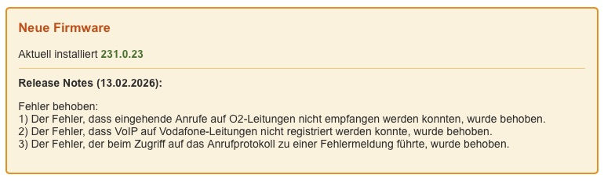
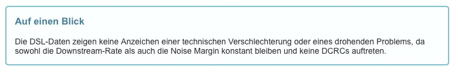
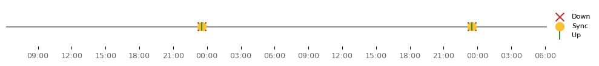
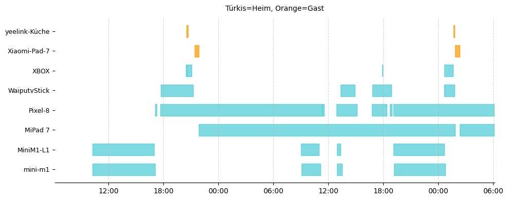
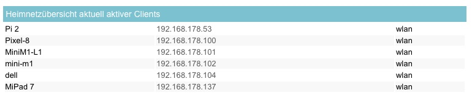
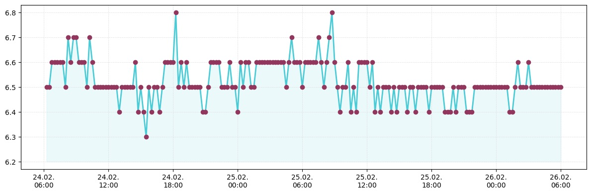
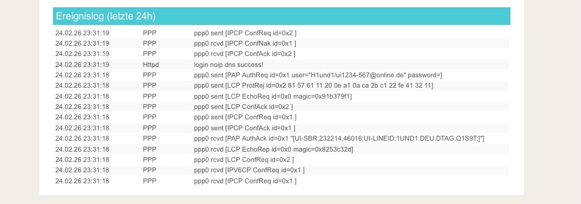

# Statusreport

Die aufgezeichneten Daten können in einem Statusreport zusammengefasst werden. 
Dieser Bericht kann direkt mit dem lokalen Browser geöffnet oder zeitgesteuert als eMail versendet werden.

Beispiel: Statusreport

## Header

Der Header zeigt
* Datum der Generierung
* Datum und Uhrzeit seit der letzten Routereinwahl
* die aktuelle IP-Adresse des Routers
* die aktuelle Download- und Upload-Geschwindigkeit

## Firmware

Falls eine neue Firmware verfügbar ist, werden die dazugehörigen Releasenotes angezeigt. 
Die Releasenotes werden von der TP-Link Seite geladen und 1:1 ausgegeben.

Hinweis: TP-Link stellt diese Informationen nicht in strukturierter Form zur Verfügung, weshalb die Gestaltung sich von Note zu Note ändern kann.

## OPTIONAL: AI Analyse der Routerdaten der letzten 24/48 Stunden

Wenn auf dem Mac der AI Shortcut installiert ist, werden die Routerdaten der letzten 24/48 Stunden analysiert und ein kurzer Bericht erstellt.
Sollten die erfassten Routerdaten zu umfangreich für die Nutzung der kostenlosen Apple/GPT Schnittstelle sein, wird der Analyseprompt als Textdatei ai_prompt_debug.txt im Skriptordner abgelegt und der Bericht nicht erstellt.
Man kann bei Bedarf diese Datei durch eine andere KI auswerten lassen.

## Eventübersicht

Die Eventübersicht zeigt Leitungstrennungen und Neuverbindungen der letzten 48 Stunden.

## Anwesenheit

Die Anwesenheitsübersicht zeigt die LAN und WLANVerbindungen der Clients der letzten 48 Stunden.
Durch unterschiedliche Farbgebung wird zwischen den verschiedenen Verbindungsarten unterschieden:
* Türkis: Heimnetz-Verbindung
* Orange: Gastnetz-Verbindung

Die Anwesenheit der Clients wird anhand der Routerlogdaten über die Zuteilung der IP durch den DHCP-Server ermittelt.

Clientnamen
Wenn im Router unter "WLAN-Teilnehmer" oder "Kabelgebundene Teilnehmer" ein Clientname hinterlegt ist, wird dieser im Statusreport angezeigt.
Der hinterlegte Name entspricht dem Namen, den der Client bei der Verbindung dem Router mitgeteilt hat. Hat man diesen in Webinterface überschrieben, wird der manuell überschriebene Name angezeigt.

Nutzt man für die Erfassung der Routerdaten Telnet/SNMP werden darüber die Clientnamen nicht übermittelt, so dass diese auch nicht in der lokalen Clientdaten eingetragen werden können.
Es empfiehlt sich bei neuhinzugekommen Clients **einmal** die Routerdatenermittlung durch zusätzliche Angabe von --gui über das Routerwebinterface zu erzwingen vx-info.py --update --gui 
Dabei wird der Clientname aus dem Webinterface gelesen und zusammen mit der MAC Adresse in der Datenbank gespeichert. Bei zukünftigen Auswertungen wird dem Client dann anhand seiner MAC-Adresse der gespeicherte Clientname zugeordnet. 
Schlägt diese Zuordnung fehl, erhält der Client in der Grafik die Bezeichnung "unknown".

## Heimnetzübersicht aktuell aktiver Clients

Zeigt die zum Zeitpunkt der Berichtserstellung im Heimnetz aktiven Clients an.

## Downstream Störabstand (dB)

Zeigt einen über die config.ini konfigurierbaren DSL-Parameter, für den man sich besonders interessiert, an.
Im Beispiel wird der Verlauf über die letzten 48 Stunden des "Störabstands im Downstream" angezeigt.

## Statistiken

**Anzahl der Reconnects im Zeitraum (48h):** 2 
**Anzahl der Reconnects in den letzten 24h:** 1 
**Anzahl der PADO_timeouts im Zeitraum (48h):** 2 
**Anzahl der PADO_timeouts in den letzten 24h:** 0 

Beispiel für typische Debuginformationen bei Verbindungsproblemen. 
Abschaltbar im [Statistics] Bereich der config.ini durch setzen der Werte auf False.

## Ereignislog der letzten 24 Stunden

Um das Log kompakt zu halten, werden Ereignisse der Typen "DHCPD" und "Mesh" nicht angezeigt. Diese können in der config.ini im Bereich [Events] unter "exclude_types" konfiguriert werden.
