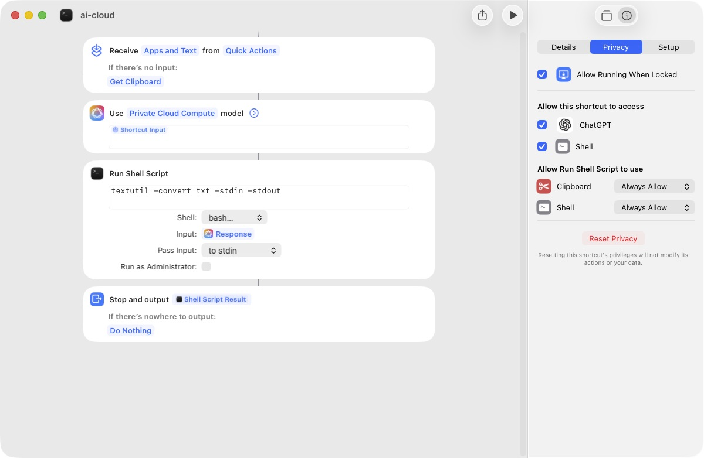

# TP-Link VX231v Tracker

Ein Set aus Python-Skripten zum automatisierten Auslesen, Speichern und Darstellen von Router-Daten des TP-Link VX231v.

## Entstehungsgeschichte

Ausgangspunkt war der Wunsch, die DSL-Leitungswerte und die aktuell verbundenen Clients im Heimnetzwerk regelmäßig zu erfassen und darzustellen.

Eine Zusammenfassung der wichtigsten in den letzten 24 Stunden erfassten Daten sollte visuell aufbereitet und als täglicher Report automatisch per E-Mail versendet werden.

Zusätzlich sollte auf Auffälligkeiten in den erfassten Daten, wie z.B. Verbindungsabbrüche oder hohe Fehlerraten, hingewiesen werden.

Da der Router keine allgemein zugängliche API bietet, wurden die Daten zuerst nur über Web-Scraping ausgelesen. 
Im nächsten Schritt wurden Telnet und SNMP hinzugefügt, um die Daten schneller und zuverlässiger auszulesen.

Hierbei ist zu beachten, dass Telnet und SNMP zwar in der Firmware des Routers vorhanden sind, aber der superadmin Account auf dem Router aktiviert sein muss, um Telnet und SNMP nutzen zu können. Die Aktivierung des Accounts wird in der Anleitung **[Aktivierung superadmin, Telnet, SNMP und iPerf3](superadmin_telnet_snmp_iperf.md)** beschrieben.

**Alle Funktionen** des Skripts können **auch ohne aktivierten superadmin Account** genutzt werden, allerdings ist dann das Web-Scraping die einzige Methode der Datenabfrage, was die langsamste und unsicherste Methode der Datenabfrage ist, so dass auch schonmal eine Abfrage fehlschlagen kann. Im Verzeichnis `logs/` finden sich dann entsprechende Fehlermeldungen.<br>
Ohne superadmin Account wechselt das Skript **automatisch** zurück zum Webscraping Modus, alternativ kann man diesen Modus **trotz** aktiviertem superadmin Account mit `--gui` erzwingen.


## Funktionen

### 1. Abfrage der Routerdaten via Telnet, SNMP und Web-Scraping
Das Skript nutzt bei aktiviertem **superadmin Account** Telnet und SNMP für den primären Abruf von Systemzuständen und DSL-Werten.
Für Daten, die über diese Schnittstellen nicht zugänglich sind, erfolgt ein automatisierter Login in die Weboberfläche mithilfe von Playwright.
Ist der **superadmin Account** nicht aktiviert, erfolgt der Datenabruf automatisch ausschließlich über das Web-Scraping-Interface.

Das Webscraping ist die langsamste Methode der Datenabfrage, daher sollte wenn möglich Telnet und SNMP genutzt werden.


### 2. Routerclients
Verbundene Geräte im Heim- und Gastnetzwerk werden registriert und deren Verbindungsdauer anhand von DHCP- und Mesh-Ereignissen aus dem Router-Log ermittelt.
Dies ermöglicht die Generierung eines Anwesenheitscharts.


### 3. Report-Generierung
Die aufgezeichneten Daten werden in einem Bericht zusammengefasst.<br>
Der Bericht kann im Browser geöffnet oder zeitgesteuert als eMail versendet werden.

<details>
    <summary>Beispiel: Statusreport</summary>
    <br>
    
</details>

### 4. Lokales Web-Dashboard
Für den schnellen Überblick der aufgezeichneten Daten können diese als interaktive Diagramme dargestellt werden. Der Zugriff erfolgt über ein lokales Web-Interface, in dem die anzuzeigen Daten und der Zeitraum ausgewählt werden können.

<details>
    <summary>Beispiel: Web-Dashboard</summary>
    <br>
    
</details>

### 5. Lokale Datenspeicherung
Sämtliche ausgelesenen Werte und Logs werden in eine SQLite-Datenbank geschrieben.<br>
Standardmäßig werden DHCP und MESH Einträge nach drei Tagen aus der DB gelöscht; in der `config.ini` (unter `[Events]`) kann die Anzahl der Tage konfiguriert werden

### 6. Lokalisierung und eigene Feldbeschriftungen
Die Datenbank `router_lang.db` dient als Übersetzungsmatrix. Sie wandelt technische Spaltennamen (z. B. `downstream_curr_rate`) für das Web-Dashboard und den HTML-Bericht in menschenlesbare Bezeichner (z. B. "Aktuelle Download-Rate") um.<br>
Eigene Übersetzungen können direkt in der router_lang.db oder auch  im Quellcode des beiliegenden Hilfsskripts `lang_editor.py` (innerhalb der Liste `translations`) angepasst und erweitert werden. Ein anschließendes Ausführen des Skripts generiert die Übersetzungsdatenbank neu.

## Einrichtung und Konfiguration

**Schnelle Installation:**
```bash
curl -sL https://raw.githubusercontent.com/deinname/tp-link-vx231v/main/install.sh | bash
```


1.  **Voraussetzungen installieren:**
    Neben Python 3 und den Modulen aus `requirements.txt` werden plattformabhängige Systemwerkzeuge benötigt:
    
    *   **Python-Umgebung & Pakete:** 
        Auf modernen Linux-Distributionen (z. B. Raspberry Pi OS, Debian) ist die Installation in eine virtuelle Umgebung (venv) notwendig:
        ```bash
        sudo apt install python3-venv  # falls nicht bereits installiert
        python3 -m venv .venv
        source .venv/bin/activate
        
        # Abhängigkeiten und Browser-Binaries in venv installieren
        pip install -r requirements.txt
        playwright install chromium
        ```
    *   **SNMP-Client:** Falls auf dem Router der superadmin Account aktiviert, müssen `snmpget` und `snmpwalk` verfügbar sein.
        *   _Debian/Raspberry Pi:_ `sudo apt install snmp`
        *   _macOS:_ `brew install net-snmp`
    *   **AI-Analyse (Optional):** Die Anomalie-Erkennung (`_run_ai_analysis`) setzt aktuell macOS voraus. Dazu ein Kurzbefehl `ai-cloud` wie auf dem folgenden Screenshot gezeigt anlegen.<br>
    Unter Linux/Debian wird die AI-Analyse aktuell noch übersprungen.<br>
    <details>
        <summary>ai-cloud shortcut anlegen</summary>
        <br>
        
    </details>

2.  **Konfigurationsdatei anlegen:**
    Die Vorlage `config.ini.sample` zu `config.ini` kopieren.
    Anschließend die Zugangsdaten für die Router Weboberfläche, SNMP, telnet sowie die E-Mail-Konfiguration an das eigene Netzwerk anpassen.

3.  **Testlauf durchführen (`--test`):**
    Überprüfen, ob die Kommunikation mit dem Router funktioniert und alle Abhängigkeiten korrekt installiert sind. Dies sollte als erster Schritt ausgeführt werden (Achtung: venv muss aktiv sein!):
    ```bash
    python3 vx-info.py --test
    ```
    Bei einer erfolgreichen Konfiguration sieht die Ausgabe folgendermaßen aus:
    ```text
    GUI Scraping
      ✓  Login in Routerweboberfläche erfolgreich
    
    Telnet Konfiguration
      ✓  telnet Login erfolgreich
    
    SNMP Konfiguration
      ✓  snmp Zugriff erfolgreich
    
    eMail Konfiguration
      ✓  eMail erfolgreich versendet
    ```
    
4.  **Erster Datenabruf:**
    Wenn der Testlauf erfolgreich war, kann das vollständige Logbuch manuell heruntergeladen und die Datenbank initialisiert werden:
    ```bash
    python3 vx-info.py --update --log
    ```


## Ausführungsoptionen (CLI)

Hauptskript `vx-info.py` mit folgenden Aufrufparametern:

*   `--update`: Fragt grundlegende Daten (Systemstatus, DSL-Werte, Client-Liste) primär über Telnet/SNMP ab und speichert sie in der Datenbank. Sind Telnet/SNMP nicht verfügbar, wird das Web-Scraping-Interface genutzt.
*   `--log`: Lädt das vollständige Systemprotokoll ("Logbuch") des Routers via Playwright-(Web-Scraping) herunter und importiert neue Ereignisse (wie DHCP/Mesh). Häufig in Kombination mit `--update` genutzt.

*   `--gui`: Erzwingt den Datenabruf (Systemstatus, DSL, Clients) ausschließlich über das Web-Scraping-Interface anstelle von Telnet/SNMP.

*   `--report-show`: Generiert den HTML-Statusbericht basierend auf den aktuellen Datenbankwerten und öffnet diesen direkt im Standard-Browser.
*   `--report-send`: Generiert den HTML-Statusbericht und versendet diesen über die in der `config.ini` hinterlegte E-Mail-Adresse.

*   `--output [DATEI]`: Schreibt die ausgelesenen Basisdaten zusätzlich als Rohdaten in eine JSON-Datei.
*   `--json-only`: Unterdrückt die standardmäßigen tabellarischen Konsolenausgaben während eines Abrufs.

*   `--test`: Testet alle installierten Technologien (Telnet, SNMP, Playwright) und verifiziert die in der `config.ini` hinterlegten Zugangsdaten sowie die E-Mail-Konfiguration. Idealerweise nach der Ersteinrichtung aufzurufen.
*   `--debug`: Aktiviert eine ausführlichere Konsolenausgabe zur Fehlerdiagnose.

*   `--dashboard`: Startet einen lokalen Webserver (Standard: Port 31311) zur interaktiven Anzeige historischer Metriken.

## Automatisierung (Cronjobs)

Für ein kontinuierliches Monitoring wird die periodische Ausführung über `cron` empfohlen. 

Typisches Ausführungsszenario:

*   **Datensicherung:** Einmal pro Stunde Systemstatus, Clients, DSL-Werte, Log sichern.
*   **Reportversand:** Einmal täglich wird ein Report generiert und per E-Mail versendet.

Die Crontab mit `crontab -e` öffnen und folgende Vorgaben einfügen (Pfade müssen an die lokale Umgebung angepasst werden):

```cron
# Einmal stündlich: Systemstatus, Clients, DSL-Werte, Log sichern
0 * * * * cd /pfad/zum/script && /pfad/zum/script/.venv/bin/python3 vx-info.py --update --log

# Täglich um 06:09 Uhr: Statusbericht generieren und per E-Mail versenden
9 6 * * * cd /pfad/zum/script && /pfad/zum/script/.venv/bin/python3 vx-info.py --report-send
```

### DSL Problem Debugging
Wird z.B. zum Debugging wegen Leitungsproblemen eine häufigere Datensicherung benötigt, kann statt der stündlichen Erfassung auch ein deutlich kürzeres Intervall gewählt werden.
Hier ist es von Vorteil, wenn **Telnet und SNMP** aktiviert sind, da man dann die DSL Leitungsdaten ohne zeitaufwendiges Webscraping in Sekunden abfragen kann.

Das Skript sollte in diesem Fall ohne die `--log` Option aufgerufen werden, da das Log nur per Webscaping zugänglich ist und damit die Skriptausführung verlangsamt.<br>

```cron
# Datenerfassung: Alle 5 Minuten werden aktuelle DSL-Werte abgefragt.
*/5 * * * * cd /pfad/zum/script && /pfad/zum/script/.venv/bin/python3 vx-info.py --update
```

Hinweis: Der Router kann das Log auch ganz ohne Skript automatisch zur Verfügung stellen, Anleitung und Optionsanpassungen folgen in Kürze!

*Getestet unter MacOS und Debian/DietPi auf einem Raspberry Pi Zero 2W*